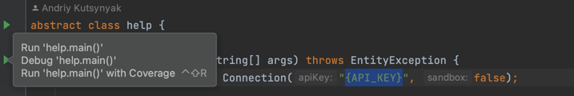

Smoke test for JAVA SDK
===========

## Usage

Environment variables:

- install JDK >=8 and <=11
- install gradle
- install IntelliJ IDEA IDE

Checkout the branch and add it as new gradle project to the IDE
Open using IDE

    ./invoiced-java/src/main/java/com/invoiced/Main.java

Replace {API_KEY} with real API key:

Examples:

    //custom url
    Connection conn = new Connection("api_key", "http://localhost:8080");
    //prod url
    Connection conn = new Connection("api_key", false);
    //sandbox url
    Connection conn = new Connection("api_key", true);

Click the green triangle below, to run the program 
